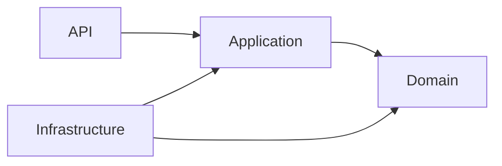
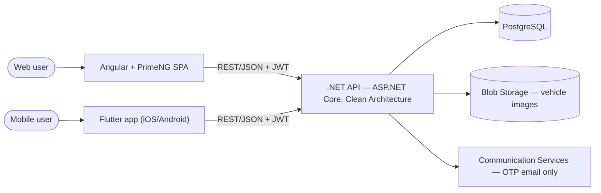
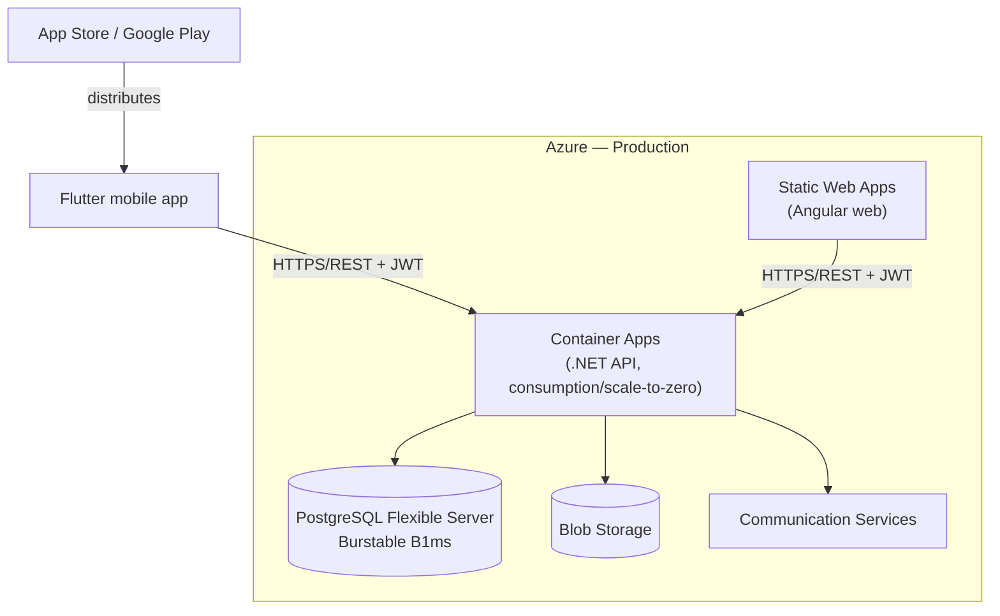
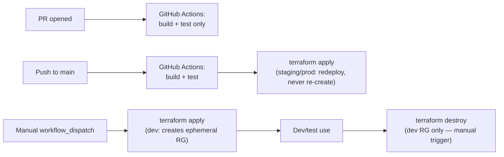
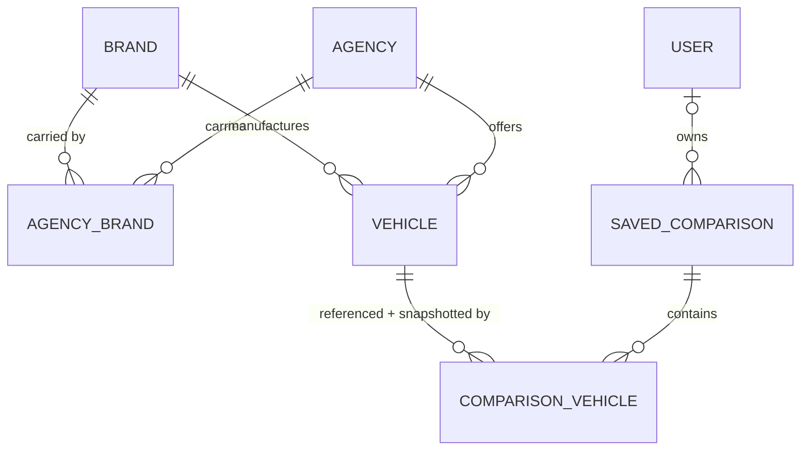

# Architecture Spine — [Proyecto Auto]

## Design Paradigm

**Clean Architecture** (Domain → Application → Infrastructure → API, dependencies point inward) governs the **backend only** (`.NET` / ASP.NET Core Web API). Angular (web) and Flutter (mobile) are **API clients** of this backend — they sit outside the layering entirely and consume it exclusively through the REST contract; neither app's internal structure is part of this paradigm.

Layer → namespace mapping:

| Layer | Namespace / folder | Depends on |
| --- | --- | --- |
| Domain | `Domain` | nothing (no outward dependencies) |
| Application | `Application` | Domain |
| Infrastructure | `Infrastructure` | Application, Domain (implements Application's interfaces) |
| API | `Api` | Application (composition root wires Infrastructure via DI) |

## Invariants & Rules

### AD-1 — Clean Architecture dependency rule [ADOPTED]

- **Binds:** all backend code (`Domain`, `Application`, `Infrastructure`, `Api`)
- **Prevents:** Infrastructure or API leaking into Domain/Application (e.g. EF Core types in domain entities, controllers calling Npgsql directly), which would make the backend's two halves (business rules vs. delivery/persistence) diverge on where logic lives.
- **Rule:** Domain has zero outward references. Application depends only on Domain and defines the interfaces Infrastructure implements. Infrastructure and API both depend inward; API is the only layer allowed to compose the DI container.



### AD-2 — Web and mobile are independent, non-sharing codebases [ADOPTED]

- **Binds:** FR-13, NFR-3 (functional parity)
- **Prevents:** treating Flutter as a thin wrapper of the Angular app or assuming shared UI code; the user chose Flutter specifically against the Ionic recommendation that would have reused web tech, so this is a real, deliberate split.
- **Rule:** Angular/PrimeNG (web) and Flutter/Dart (mobile) share **no UI code**. The only shared contract between them is the backend REST API. Functional parity (NFR-3) is verified against the API contract, not against each other's implementation.

### AD-3 — Design tokens implemented independently, must not drift

- **Binds:** DESIGN.md tokens, Angular/PrimeNG theme, Flutter theme
- **Prevents:** the Angular `definePreset` (Aura) and the Flutter theme silently diverging over time, since two independently-built frontends have no shared theming code to keep them honest.
- **Rule:** `DESIGN.md` is the single source of truth for tokens. Both the Angular `definePreset` mapping and the Flutter `ThemeData`/`ColorScheme` mapping are reviewed against `DESIGN.md` directly, never against each other's output. Any token change lands in `DESIGN.md` first.

### AD-4 — Both clients are pure API clients for auth

- **Binds:** FR-15, FR-16
- **Prevents:** Angular and Flutter implementing divergent session/token handling, either one embedding auth logic (e.g. OTP verification rules) instead of delegating to the API, or either client offering a phone/SMS signup path the backend can't fulfill.
- **Rule:** All auth (OTP request/verify, token issuance/refresh) happens via the same REST endpoints, backed by JWTs. Clients only request, store, and attach tokens — neither client owns or duplicates auth logic. OTP ships **email-only in the MVP** (see Stack, Deferred) — neither client exposes a phone/SMS signup or verification path until a non-ACS SMS provider is added. JWTs are stored using each platform's secure storage convention (httpOnly secure cookie or platform secure storage) — never plain `localStorage`/`SharedPreferences` — same floor for both Angular and Flutter.

### AD-5 — Owner-scoped access to saved comparisons

- **Binds:** FR-11, FR-16
- **Prevents:** two independently-built endpoints/handlers diverging on whether they filter `SavedComparison` by the authenticated owner, leaking one user's comparisons to another. EF Core/Postgres has no native RLS enforcement the way directly-accessed Supabase Postgres does, so this must be enforced explicitly.
- **Rule:** Every query or command touching `SavedComparison` passes through one centralized ownership check (e.g. an EF Core global query filter keyed on the authenticated user id, or a single Application-layer authorization handler) — no per-endpoint ad hoc filtering.

### AD-6 — Geography is a first-class dimension on Agency

- **Binds:** NFR-5, FR-1
- **Prevents:** hardcoding Monterrey into queries/filters such that adding a second city requires a redesign.
- **Rule:** `Agency` carries structured, queryable `city`/`state`/`country` fields from the MVP onward — never a single free-text or implicitly-Monterrey field. Multi-city rollout mechanics beyond this are Deferred.

### AD-7 — Share links use a separate public identity

- **Binds:** FR-12
- **Prevents:** public share URLs exposing or being guessable from internal sequential ids, and the public endpoint requiring auth.
- **Rule:** `SavedComparison` exposes a non-sequential public share token (opaque id/slug) distinct from its internal id. The public share endpoint resolves only by this token, requires no auth, and never accepts the internal id.

### AD-8 — Comparison cap enforced at both API and data layer

- **Binds:** FR-10, EXPERIENCE.md tope de comparación
- **Prevents:** a future endpoint or client bypassing the UI's 3-vehicle limit and writing an oversized comparison; a plain SQL `CHECK` constraint can't do this (it can't count sibling rows), so "DB-level constraint/check" alone left the mechanism ambiguous.
- **Rule:** Max 3 vehicles per `SavedComparison` is validated in the API on create/update AND enforced by a Postgres trigger on `ComparisonVehicle` that counts existing rows for the same `SavedComparisonId` and raises on insert past 3. A trigger is used (not an application-layer transactional check) because it can't be bypassed by any write path that reaches the table directly — including future endpoints or backoffice tooling — whereas an app-layer check only protects the paths that call it.

### AD-9 — Availability freshness is server-authoritative

- **Binds:** NFR-1, FR-9
- **Prevents:** each client computing or wording its own "estimada"/staleness label from local logic, causing inconsistent freshness claims between Angular and Flutter.
- **Rule:** `Vehicle`/listing carries a server-set `last_updated` (or equivalent) timestamp. Any "estimada" badge or relative-date microcopy is derived from this field by the client at render time — never hardcoded or independently inferred.

### AD-10 — Saved comparisons snapshot data at save time

- **Binds:** FR-11, FR-12, EXPERIENCE.md State Patterns (comparación guardada no se auto-actualiza; comparación compartida se invalida si el vehículo sale del catálogo)
- **Prevents:** divergence between "price/availability shown is frozen at save time" and "share-link validity depends on the vehicle still existing in the live catalog" being implemented inconsistently (or one of the two rules being dropped).
- **Rule:** `SavedComparison` (via `ComparisonVehicle`) stores both (a) a reference to each `Vehicle`, used only to check it still exists in the catalog (share-link invalidation), and (b) a frozen snapshot of the comparable attributes (price, availability, etc.) as of save time. Reads of a saved or shared comparison always render the snapshot, never a live join to current vehicle data. "Still exists in the catalog" means `Vehicle.is_active = true`, not row presence — catalog vehicles are never hard-deleted (see Consistency Conventions).

### AD-11 — Backoffice is a role-gated section of the same Angular app, not a separate app [ADOPTED]

- **Binds:** FR-14
- **Prevents:** one team building/deploying a separate admin app while another assumes a single Angular codebase with role-gated routes — a real divergence (deployment topology, routing, auth wiring), not just a structural detail.
- **Rule:** The backoffice/admin UI is a role-gated section inside the same Angular codebase and deployment as the customer-facing app — never a separate app, repo, or Static Web Apps instance. Staff/admin accounts authenticate through the same AD-4 OTP flow as customers; access is distinguished by a `role`/permission field on `USER`, not a separate credential model. (Decided in the coaching conversation, not merely inferred here.)

### AD-12 — NFR-2 is bound by indexing, with Container Apps cold-start named as an explicit, unresolved tension [ADOPTED]

- **Binds:** NFR-2
- **Prevents:** search/filter performance being left as an unaddressed assumption while Container Apps' scale-to-zero silently works against the <2s budget.
- **Rule:** Every filterable column carries a database index — year, price, body type, transmission, equipment tier, color, availability, and `Agency.city`/`state` (per AD-6). Container Apps' scale-to-zero introduces a cold-start tension with NFR-2's <2s target on the first request after an idle period; this is a real, deferred-but-flagged trade-off, not silently resolved. The mitigation lever — a minimum replica count / "always ready" instance during business hours — trades away scale-to-zero's cost savings and is an implementation-time call, not fixed here.

### AD-13 — AGENCY_BRAND is a derived fact, never independently curated [ADOPTED]

- **Binds:** FR-2, FR-3, FR-14
- **Prevents:** a backoffice curation module and a vehicle-upload module disagreeing on which brands an agency carries — one editing `AGENCY_BRAND` directly, the other implying it transitively through `Vehicle` rows, producing two sources of truth for the same fact.
- **Rule:** `AGENCY_BRAND` is computed/materialized from the agency's actual `Vehicle` inventory — an agency carries a brand if and only if it has at least one `Vehicle` of that brand. It is never a table a backoffice user edits directly; any UI showing "brands carried" reads this derived set, it does not write to it.

### AD-14 — Saved comparisons are immutable once shared [ADOPTED]

- **Binds:** FR-11, FR-12, AD-10
- **Prevents:** the vehicle composition behind an already-issued share link silently changing (e.g. owner removes a vehicle from "Mis comparaciones guardadas" after sharing), which would violate the "never expires, and shows what it was" guarantee — extending AD-10's snapshot philosophy from attributes to composition, not contradicting it.
- **Rule:** Once a `SavedComparison` has had a share token issued, its set of `ComparisonVehicle` rows is immutable. Removing a vehicle from a shared comparison does not mutate the shared row — it is either blocked, or forks a new `SavedComparison` (with its own share token) reflecting the edited set.

### AD-15 — SavedComparison can be created anonymous, later claimed by an owner [ADOPTED]

- **Binds:** FR-11, FR-12, FR-16, AD-5
- **Prevents:** "Compartir" (usable without a session) and "Guardar" (which requires auth) creating two separate rows for the same comparison — leaving an orphaned, ownerless row permanently unreachable from "Mis comparaciones guardadas."
- **Rule:** `SavedComparison.owner` is nullable. The first "Comparar"/"Compartir" action creates the row with a null owner. A subsequent "Guardar" (by an existing or freshly-OTP-created user) assigns that owner to the *same* row rather than creating a second one. AD-5's ownership check simply doesn't surface null-owner rows in "Mis comparaciones guardadas" until claimed.

### AD-16 — REST contract is defined by a published OpenAPI spec [ADOPTED]

- **Binds:** FR-4, FR-5, FR-6, FR-7, FR-8, FR-9, FR-13, NFR-3
- **Prevents:** Angular and Flutter each building a plausible-but-incompatible client (different query param names/casing/enum values) against prose-only endpoint descriptions — neither AD-2 nor AD-4 requires the contract to be written down anywhere.
- **Rule:** The REST API contract is defined by an OpenAPI spec generated from the `Application`/`Api` layers (ASP.NET Core's built-in OpenAPI/Swagger generation), published and versioned. Both Angular and Flutter clients are built and validated against that spec — never against each other's assumptions or hand-read backend code.

### AD-17 — CI/CD exists from the first endpoint, no manual deploy path [ADOPTED]

- **Binds:** all deployment of the `.NET` API, Angular web, and their Azure infrastructure, from the repository's first commit onward
- **Prevents:** a manual/local "it works on my machine" deploy path becoming the de facto authoritative one before automation catches up — which, once real, is expensive to retrofit and lets two developers (or the same developer on two days) diverge on how a deploy actually happens.
- **Rule:** From the first endpoint, every push to `main` and every PR runs an automated GitHub Actions pipeline (build, test; PRs run build+test only). A PR cannot merge without passing the pipeline. No `terraform apply`/`destroy` or deploy step is ever run by hand from a developer's local CLI — dev, staging, and production all go through the pipeline, matching AD-18.

### AD-18 — Infrastructure is Terraform-defined; dev resource groups are ephemeral [ADOPTED]

- **Binds:** every Azure resource (Container Apps, Static Web Apps, Postgres Flexible Server, Blob Storage, Communication Services, resource groups)
- **Prevents:** manual ("ClickOps") provisioning in the Azure portal that can't be reliably reproduced or torn down — which both causes environment drift between dev/staging/prod and leaves dev resources running (and billing) between work sessions.
- **Rule:** All Azure infrastructure is defined in Terraform (`azurerm` provider), version-controlled in the same repository as the app code. Dev-environment resource groups are created and destroyed **on demand** — via a manually-triggered pipeline run (`workflow_dispatch`), not automatically on every PR or push — specifically so an active work session gets a real environment without every open PR silently accumulating its own billed resource group. Staging/production resource groups are longer-lived, created once by the pipeline on first setup, and redeployed (never re-created) on every `main` push.

## Consistency Conventions

| Concern | Convention |
| --- | --- |
| Naming (entities, files, interfaces, events) | Backend/domain code uses English entity names mapped 1:1 from the PRD glossary: Agencia→`Agency`, Marca→`Brand`, Vehículo→`Vehicle`, Comparación→`Comparison`/`SavedComparison`. User-facing copy stays Spanish per EXPERIENCE.md. REST resources are plural nouns (`/agencies`, `/vehicles`, `/comparisons`). |
| Data & formats (ids, dates, error shapes, envelopes) | Internal ids: sequential/GUID, never exposed on public share endpoints (see AD-7). Public share id: opaque token/slug. Dates/timestamps: ISO 8601 UTC over the wire. Error responses: RFC 7807 Problem Details envelope for all REST error responses — no per-endpoint bespoke error shapes. |
| State & cross-cutting (mutation, errors, logging, config, auth) | JWT validation happens once, centrally, in ASP.NET Core middleware — not re-implemented per endpoint. Owner-scoping for `SavedComparison` follows AD-5's single centralized mechanism. Structured logging; environment-specific config (dev/staging/prod) via configuration providers, no secrets in source. |
| Design tokens across frontends | `DESIGN.md` is authoritative; Angular's `definePreset` (Aura, class-based `darkModeSelector`) and Flutter's `ThemeData` are each verified against `DESIGN.md` directly (see AD-3), not against each other. |
| Catalog vehicle removal | Catalog vehicles are never hard-deleted; removal during the weekly refresh sets an `is_active`/`deactivated` flag. "Still exists in the catalog" (AD-10) means `is_active = true`, not "the row is present." |

## Stack

| Name | Version |
| --- | --- |
| Angular | latest (tracked at implementation time) |
| PrimeNG | current release, Aura preset — under PrimeUI Community License (free; startup qualifies today: <$1M revenue, <5 devs, <10 employees, <$3M VC funding) |
| Flutter / Dart | latest stable |
| .NET | 10 (LTS/STS current, verified via Context7) |
| ASP.NET Core | 10 |
| EF Core | 10 (matching .NET 10) |
| Npgsql (EF Core provider) | current release compatible with EF Core 10 |
| PostgreSQL | current supported major on Azure Database for PostgreSQL Flexible Server |
| Azure Container Apps | consumption plan (scale-to-zero) |
| Azure Static Web Apps | Standard tier |
| Azure Database for PostgreSQL Flexible Server | Burstable B1ms tier |
| Azure Communication Services | Email only (SMS unsupported for Mexico numbers — hard ACS capability gap, not deferred-for-cost) |
| Azure Blob Storage | — |
| GitHub Actions | CI/CD — private repo, Free plan (2,000 Linux minutes/month, verified 2026) |
| Terraform | `azurerm` provider — IaC for all Azure resources (AD-18) |

## Structural Seed

### System / container view



### Deployment & environments



Staging and production mirror this topology as longer-lived, Terraform-managed resource groups (AD-18), sized down where the MVP budget requires. **Dev is different by design:** its resource group is ephemeral — created and destroyed on demand, not always-on — to avoid paying for idle dev infrastructure between work sessions.

### CI/CD & environment lifecycle



Dev resource groups are named per-session and created/destroyed only by an explicit manual pipeline trigger — never automatically per PR (which would multiply billed resource groups instead of controlling cost) and never from a developer's local Terraform CLI, so the lifecycle stays reproducible. Staging/production are never destroyed by this flow; `main` pushes redeploy into the existing resource group.

### Core-entity ERD



Load-bearing invariants on these entities (see AD-6, AD-8, AD-9, AD-10, AD-13, AD-14, AD-15 for the rules — full field-by-field schema is a code concern, not a spine concern):
- `AGENCY`: city/state/country are structured, queryable fields (AD-6).
- `AGENCY_BRAND`: derived from `VEHICLE` inventory, never independently curated (AD-13).
- `VEHICLE`: carries a server-set freshness timestamp (AD-9); never hard-deleted — `is_active` governs catalog membership (Consistency Conventions, AD-10).
- `SAVED_COMPARISON`: capped at 3 `COMPARISON_VEHICLE` rows (AD-8); nullable owner, claimed on save (AD-15); composition immutable once shared (AD-14); exposes a public share token distinct from its internal id (AD-7).
- `COMPARISON_VEHICLE`: holds both a live reference to `VEHICLE` (existence check) and a frozen attribute snapshot as of save time (AD-10).

### Backend source tree

```text
src/
  Domain/           # entities, value objects, domain rules — no outward dependencies
  Application/       # use cases/handlers, interfaces (repositories, auth, OTP), DTOs, validation
  Infrastructure/    # EF Core DbContext, Npgsql, Blob Storage client, Communication Services client, repository implementations
  Api/                # ASP.NET Core Web API — controllers/endpoints, auth middleware, composition root (DI), role-gated backoffice (FR-14) as a section of this same API/app — the Angular admin UI is likewise a role-gated section of the same web app, not a separate app (AD-11)
```

Angular and Flutter source trees are not fixed here — their internal structure is not load-bearing at this altitude (see AD-2).

## Deferred

- **Exact PostgreSQL schema & migrations** — field-by-field detail is a code concern; only load-bearing invariants (AD-6, AD-8, AD-9, AD-10) are fixed here.
- **Flutter's CI/CD pipeline specifics** — AD-17 fixes that CI/CD exists from the first endpoint for the .NET API and Angular web; the mobile app-store release pipeline (build signing, TestFlight/Play internal track automation) is not designed here.
- **Dev-database seed/fixture data** — a freshly `terraform apply`'d dev resource group starts with an empty Postgres. How dev gets sample agencies/brands/vehicles (a seed script, a snapshot restore, or manual entry) is not decided here — whatever mechanism is chosen must still respect AD-13 (`AGENCY_BRAND` is derived, never independently seeded/written).
- **Observability/monitoring stack** — no APM/logging backend chosen yet (e.g. Application Insights); NFR-4's 99% uptime target has no monitoring implementation bound to it yet.
- **Rate limiting specifics** — no thresholds or middleware chosen for the public share endpoint or OTP request endpoint.
- **Exact Azure region** — cost estimate and topology are region-agnostic; region selection (proximity to Monterrey, data residency) not made here.
- **SMS OTP channel — future phase, requires a different provider** — OTP is email-only in the MVP (AD-4). Azure Communication Services cannot deliver SMS to Mexico numbers at all (a hard capability gap, not a pricing question); adding SMS later means integrating a different provider (e.g. Twilio, which does support Mexico), not a config change to ACS.
- **PrimeNG licensing threshold** — currently free under the Community License; re-evaluate (commercial license $599–799/dev, or migrate to Spartan/pinned Angular 21 + PrimeNG 21) if the company crosses $3M VC funding, 10 employees, 5 developers, or $1M revenue.
- **Multi-city rollout mechanics** — AD-6 fixes that geography must not be hardcoded; the actual process/tooling for onboarding a second city (curation workflow, launch checklist) is not designed here.
- **Backup/DR policy specifics** — Postgres Flexible Server backup retention/restore process and Blob Storage redundancy tier are not decided.
- **ASP.NET Core Identity passwordless assembly detail** — confirmed feasible (token providers + custom sign-in endpoint) but the exact endpoint/token-provider wiring is implementation detail, not an architectural decision.
- **Monetization model** — explicitly undecided in the PRD (Open Questions); out of scope for this build substrate.
- **Product naming** — placeholder `[Proyecto Auto]` remains in use per PRD Open Questions; not an architecture concern.
